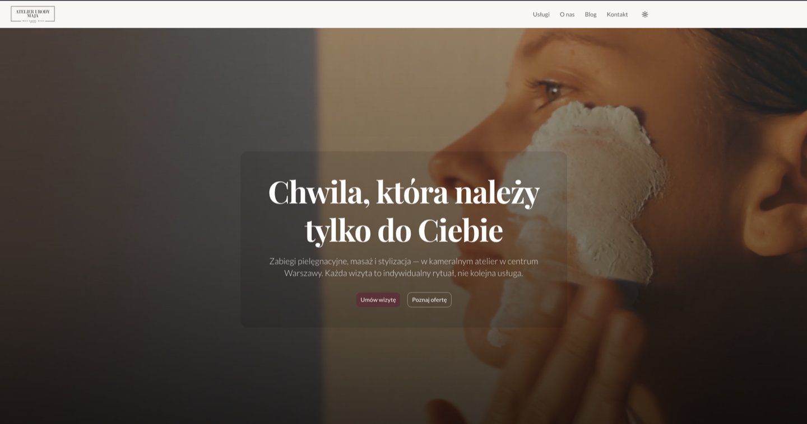

# Local Beauty Studio

A production-ready landing page and blog for a local beauty salon, built as a portfolio project.


**[Live demo →](https://local-beauty-studio.netlify.app)**



---

## About

A content-managed website for a local beauty salon: landing page with a page builder, blog, and a contact form that sends email via Resend. Built as a portfolio/demo project to demonstrate web development capabilities.

The site owner manages all page content through an embedded Sanity Studio (`/studio`) — reordering sections, editing copy, publishing posts — without any developer involvement. On-demand ISR ensures content changes go live within seconds after publishing.

---

## Tech Stack

| Layer      | Technology                                         |
| ---------- | -------------------------------------------------- |
| Framework  | Next.js 16, App Router, TypeScript strict          |
| Styling    | Tailwind CSS v4                                    |
| UI         | shadcn/ui + Radix UI                               |
| Animations | Framer Motion                                      |
| CMS        | Sanity v3 (embedded Studio at `/studio`)           |
| Forms      | React Hook Form + Zod                              |
| Email      | Resend + React Email                               |
| Fonts      | next/font (Playfair Display + Lato)                |
| Dark mode  | next-themes (class strategy)                       |
| Icons      | Lucide React                                       |
| Deploy     | Netlify (ISR + on-demand revalidation via webhook) |

---

## Architecture Highlights

- **Page Builder pattern** — the client arranges sections via drag & drop in Sanity Studio; the frontend maps `_type` to React components. No code changes needed to reorder or remove sections.
- **ISR + Sanity webhook** — on-demand revalidation via `revalidateTag`, triggered by a Sanity webhook on content publish. No full rebuild, no fixed revalidation interval.
- **Embedded Sanity Studio at `/studio`** — one domain, one deploy, no separate CMS hosting.
- **Dynamic icon loading with cache** — Lucide icons are loaded by kebab-case string from CMS using `lucide-react/dynamicIconImports` + `next/dynamic`, with a module-level cache to avoid reinstantiating components on every render.

---

## Project Structure

```
local-beauty-studio/
├── app/                        # Next.js App Router — pages, API routes, layouts
│   ├── (site)/                 # Public-facing routes (page builder + blog)
│   ├── studio/                 # Embedded Sanity Studio
│   └── api/                    # Contact form endpoint + ISR revalidation webhook
│
├── components/
│   ├── sections/               # Page builder section components (one file per block type)
│   │   ├── PageBuilder.tsx
│   │   ├── HeroSection.tsx
│   │   ├── RichTextSection.tsx
│   │   ├── TextImageSection.tsx
│   │   ├── TextVideoSection.tsx
│   │   ├── TextMediaSection.tsx
│   │   ├── ServicesSection.tsx
│   │   ├── PricingSection.tsx
│   │   ├── TestimonialsSection.tsx
│   │   ├── StatsSection.tsx
│   │   ├── GallerySection.tsx
│   │   ├── BlogPreviewSection.tsx
│   │   ├── CtaSection.tsx
│   │   ├── ContactSection.tsx
│   │   ├── TeamSection.tsx
│   │   ├── FaqSection.tsx
│   │   ├── ProcessSection.tsx
│   │   └── BadgesSection.tsx
│   ├── blog/                   # Post card, Portable Text renderer, Table of Contents
│   ├── layout/                 # Navbar, Footer
│   └── shared/                 # AnimatedSection, SanityImage, ThemeToggle
│
├── sanity/
│   ├── schemas/                # Sanity document + section schemas
│   ├── queries.ts              # All GROQ queries (never inline in components)
│   ├── client.ts
│   └── custom-types.ts         # Derived types for blocks with document references
│
├── lib/                        # Utilities: icon service, video URL helpers, Zod schemas
├── emails/                     # React Email templates
└── public/
```

---

## Getting Started

### Prerequisites

- Node.js 20.9+
- pnpm
- [Sanity account](https://sanity.io) (free tier)
- [Resend account](https://resend.com) (free tier)

### Installation

```bash
git clone https://github.com/[username]/local-beauty-studio.git
cd local-beauty-studio
pnpm install
```

### Environment Variables

Create `.env.local` in the project root:

```bash
# Sanity — find these in your Sanity project settings
NEXT_PUBLIC_SANITY_PROJECT_ID=
NEXT_PUBLIC_SANITY_DATASET=production
NEXT_PUBLIC_SANITY_API_VERSION=2024-01-01

# Resend — API key from resend.com dashboard
RESEND_API_KEY=
# Email addresses for the contact form
CONTACT_FROM_EMAIL=
CONTACT_TO_EMAIL=

# Site URL (used for canonical links and email templates)
NEXT_PUBLIC_SITE_URL=http://localhost:3000
```

```bash
pnpm dev
```

Open [http://localhost:3000](http://localhost:3000). The Sanity Studio is available at [http://localhost:3000/studio](http://localhost:3000/studio).

---

## Available Commands

| Command                        | Description                                   |
| ------------------------------ | --------------------------------------------- |
| `pnpm dev`                     | Dev server (Turbopack)                        |
| `pnpm build`                   | Production build                              |
| `pnpm lint`                    | ESLint                                        |
| `pnpm format`                  | Prettier                                      |
| `pnpm sanity schemas extract`  | Compile `schema.json` from TypeScript schemas |
| `pnpm sanity typegen generate` | Regenerate TypeScript types from schemas      |

> Always run `schemas extract` before `typegen generate` — typegen reads the compiled JSON, not the TS source.

---

## Page Builder Blocks

Content is managed through Sanity Studio. The page builder supports 16 section types:

| Block type            | Component             | Description                                                                                |
| --------------------- | --------------------- | ------------------------------------------------------------------------------------------ |
| `sectionHero`         | `HeroSection`         | Full-width hero with image or autoplay background video, two CTA buttons                   |
| `sectionRichText`     | `RichTextSection`     | Standalone Portable Text block — headings, lists, links; configurable width and background |
| `sectionTextImage`    | `TextImageSection`    | Portable Text body alongside an image, with configurable image position                    |
| `sectionTextVideo`    | `TextVideoSection`    | Portable Text body alongside an embedded YouTube or Vimeo video                            |
| `sectionServices`     | `ServicesSection`     | Grid of service cards pulled from `service` documents                                      |
| `sectionPricing`      | `PricingSection`      | Pricing table with name, description, price string, and duration                           |
| `sectionTestimonials` | `TestimonialsSection` | Carousel of client testimonials from `testimonial` documents                               |
| `sectionStats`        | `StatsSection`        | Animated counters for key numbers (years, clients, treatments, etc.)                       |
| `sectionGallery`      | `GallerySection`      | Photo gallery with grid or masonry layout                                                  |
| `sectionBlogPreview`  | `BlogPreviewSection`  | Latest N posts pulled automatically from the blog                                          |
| `sectionCta`          | `CtaSection`          | Call-to-action strip with heading, two buttons, and background style                       |
| `sectionContact`      | `ContactSection`      | Contact form, contact data from siteSettings                                               |
| `sectionTeam`         | `TeamSection`         | Staff member cards from `person` documents                                                 |
| `sectionFaq`          | `FaqSection`          | Accordion FAQ with Portable Text answers                                                   |
| `sectionProcess`      | `ProcessSection`      | Numbered process steps in horizontal or vertical layout                                    |
| `sectionBadges`       | `BadgesSection`       | Trust badges / partner logos strip (max 6)                                                 |

Each block supports an optional `anchor` field for same-page navigation (`#section-id`).

---

## Deployment

The project is deployed on Netlify.

A Sanity webhook calls `/api/revalidate` on every content publish, which triggers `revalidateTag` for the affected content type (`page`, `post`, or `settings`). Pages are regenerated on next request — no full site rebuild needed.

**Required environment variables for deployment:** all variables listed in the [Environment Variables](#environment-variables) section above, plus `SANITY_REVALIDATE_SECRET` (shared between the webhook and the API route).
